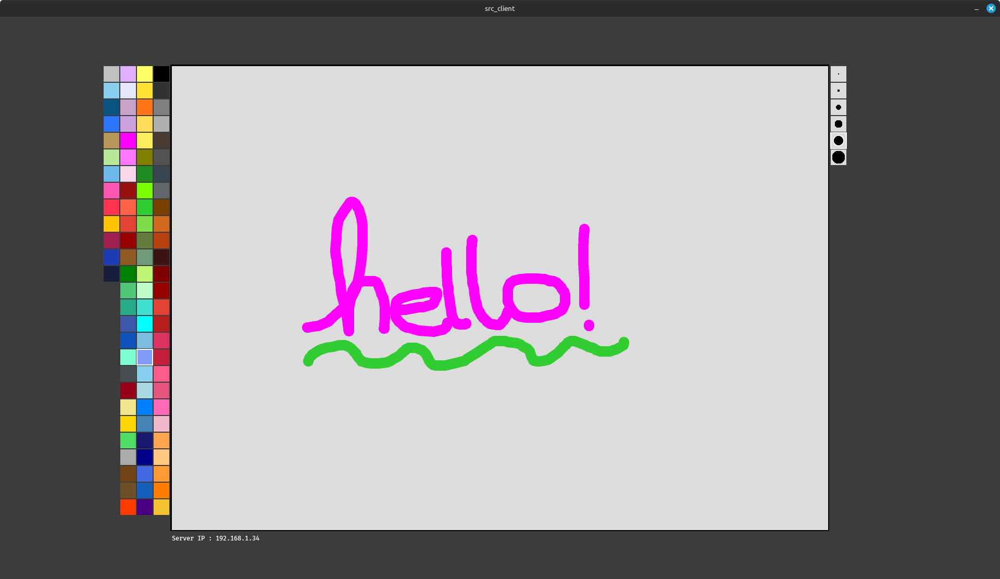
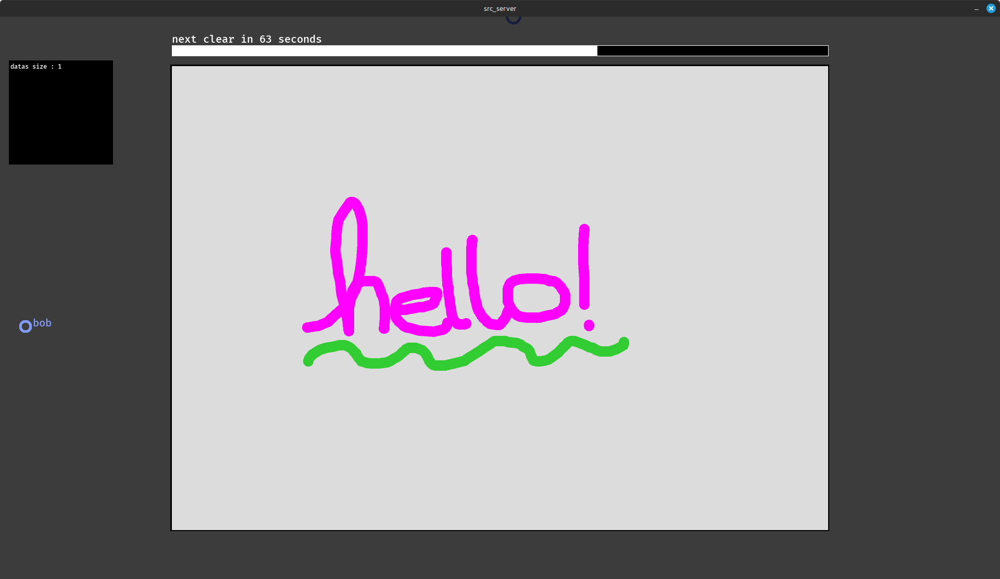

# Pixelteam

[ENG]  
Pixelteam is a simple tool to draw a shared canvas with your friends. IT's a processing application that uses a server to share the canvas between multiple clients. Each client can draw on the canvas of the server.
Every 3 minutes the server saves the canvas to a file and reboot all the client's canvas.

This project are made for the openday of the ESADSE (École Supérieure d'Art et Design de Saint-Étienne) in Junary 2025.

[FR]  
Pixelteam est un outil simple permettant de dessiner sur une toile partagée avec vos amis. C'est une application créée avec Processing, qui utilise un serveur pour partager la toile entre plusieurs clients. Chaque client peut dessiner sur la toile hébergée par le serveur.
Toutes les 3 minutes, le serveur sauvegarde la toile dans un fichier et réinitialise les toiles de tous les clients.

Ce projet a été réalisé pour la journée portes ouvertes de l'ESADSE (École Supérieure d'Art et Design de Saint-Étienne) en janvier 2025.

## How to use it

### Server

To start the server, you need to run the folder "src_server".

### Client

To start the client, you need to run the folder "src_client".

### Client

### Server

